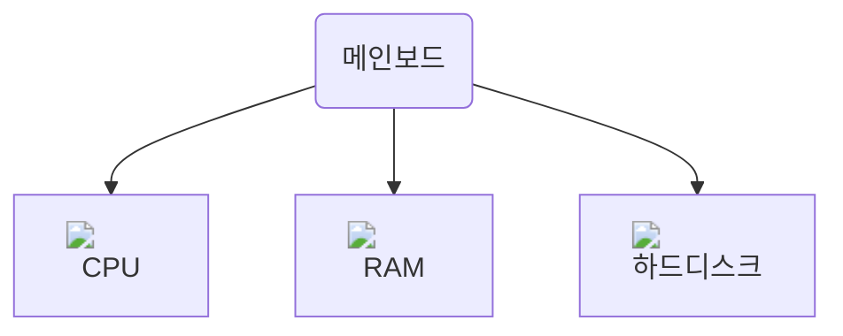
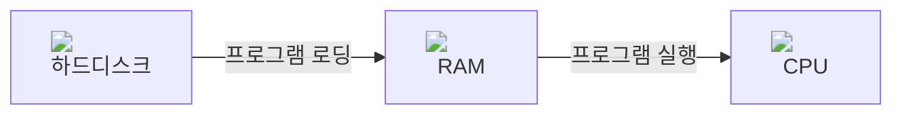

개발자를 쉽게 표현하면 컴퓨터에서 돌아가는 코드를 짜는 사람입니다.

여러분들은 아마 컴퓨터를 많이 사용해보셨을 것입니다. 그렇다면 혹시 컴퓨터를 사용하면서, 컴퓨터가 어떻게 작동하는지에 대한 궁금증을 가져보신 적이 있나요? 아니면 컴퓨터의 각 부품이 어떻게 작동하고 어떤 과정으로 코드와 프로그램이 실행되는지 의문을 가진 적이 있나요?

없으셔도 괜찮습니다. 이제부터 재밌게 알아가면 됩니다.

## 컴퓨터

컴퓨터를 조립할 때는 메인보드라는 회로(PCB)에 여러 부품을 연결하게 됩니다. 컴퓨터에 관심 있으시다면 CPU, 램, 메모리, 그래픽카드, 하드디스크 등의 용어를 들어보셨을겁니다. 그러한 것들이 부품이 되어서 우리가 사용하는 컴퓨터를 이루게 됩니다.

앞에서도 언급했듯 개발을 한다는 것은 컴퓨터에서 돌아가는 코드를 짜는 것이기에 연결되는 컴퓨터 부품들을 어떻게 효율적으로 이용, 활용해야할지에 대한 고민이 필요합니다. 즉, 여러분들은 컴퓨터가 어떤 구조로 구성되어있는지를 이해하셔야합니다. 아직 컴퓨터에 대해 잘 모르시더라도 괜찮습니다. 이 문서에서 중요한 부품의 각 역할에 대해서 설명드리겠습니다.

아래는 컴퓨터의 구조를 아주 간단하게 나타낸 도식입니다.



### CPU

인간으로 치면 뇌의 역할을 하는, 컴퓨터의 핵심적인 부분입니다.  CPU는 메모리에 저장된 명령어를 읽어 들이고, 읽어 들인 명령어를 해석하고, 실행하는 부품입니다. 

CPU는 간단하게 보면 실제로 계산 작업을 하는 ALU, 작은 저장장치인 레지스터 두 부분으로 나뉩니다.

- ALU는 **계산을 수행**하는 부품입니다. 컴퓨터 내부에서 수행되는 대부분의 계산은 ALU가 도맡아 수행합니다. 여러 연산 작업을 아주 빠르게 수행할 수 있습니다.

- 레지스터는 CPU 내부의 **작은 저장 장치**입니다. 사람이 외워야할 영어 단어나, 할 일을 종이에 적거나 스마트폰에 적어두듯이 컴퓨터도 할 일을 적어놓을 공간이 필요합니다. 레지스터는 프로그램을 실행하는 데 필요한 값들을 임시로 저장합니다. 

레지스터는 데이터를 매우 빠르게 기록할 수 있지만 가격이 비싸기 때문에, 연산에 바로 필요한 소량의 데이터만 저장합니다. 당장 필요하진 않지만 자주 가져와야하는 데이터들은 RAM에 저장합니다.

### RAM(메모리)

RAM(메모리)는 현재 실행되는 프로그램의 명령어와 데이터를 저장하는 부품입니다. 즉, 프로그램이 실행되려면 반드시 메모리에 저장되어 있어야 합니다. CPU가 계산하는 값을 잠시 저장하기 위해서도 사용합니다. 

컴퓨터의 연산 정보를 기억하기 위해 주로 사용되기에 주 기억장치라고도 부릅니다. 레지스터보다 데이터 기록 속도가 느리지만 더 많은 용량을 사용할 수 있습니다.

RAM은 전원을 끄면 저장된 정보가 다 사라진다는 특징이 있습니다. 이러한 특징을 휘발성이라고 합니다. 혹시 문서나 PPT 작업을 하다가 날아간 기억이 있으신가요? 이게 바로 RAM에만 저장을 해놓아서 일어나는 일입니다. 이를 해결하기 위해선 전원이 꺼져도 정보를 저장해놓을 수 있는 저장공간이 필요했는데, 그것이 바로 하드디스크입니다.

### 하드디스크

하드디스크는 정보를 장기적으로 저장하는 저장소입니다. 메모리와 다르게 전원이 꺼져도 데이터가 사라지지 않습니다. 보조 기억장치로도 불립니다.

메모리보다 데이터 기록 속도가 느리지만 더 많은 용량을 사용할 수 있습니다. 이렇듯 컴퓨터 저장장치에서 속도와 용량은 반비례하는 관계입니다. 속도가 빠르다면 용량이 크기 어렵고, 용량이 크다면 보통 속도가 느립니다.

하드 디스크외에도 SSD, USB 메모리, DVD, CD-ROM과 같은 저장 장치가 보조 기억장치 역할을 할 수 있습니다.

### 컴퓨터 부품간의 상호작용

정리하자면 아래와 같습니다.
- CPU는 메모리에 저장된 명령어를 읽어 들이고, 해석하고, 실행하는 부품
- 메모리는 현재 실행되는 프로그램의 명령어와 데이터를 저장하는 부품
- 보조 기억장치는 전원이 꺼져도 보관할 프로그램을 저장하는 부품

컴퓨터가 프로그램을 실행하는 과정을 보면 세 부품이 서로 어떻게 협동하는지 이해할 수 있습니다. 

1. 컴퓨터 프로그램은 기본적으로 보조 기억장치에 저장됩니다. 
2. 프로그램이 실행되면 디스크에 있는 프로그램을 메모리에 저장합니다. 이 과정을 로딩이라고 부릅니다.
3. 메모리에 있는 프로그램을 CPU에서 실행합니다.

<br/>

<br/>

이처럼 프로그램을 실행하는데는 이 컴퓨터의 세 부품이 주로 사용됩니다. 빠르고 효율적으로 동작하는 프로그램을 개발하기 위해서는 보통 더 적은 양의 메모리를 사용하고, 더 적은 디스크 접근(입출력), 더 적은 CPU 연산을 하도록 해야합니다. 보통 이러한 것들을 프로그램의 성능 지표라고 부르고 개선합니다.

프로그램을 메모리로 옮기고 CPU로 실행하기 위해 제어하는 자세한 동작은 컴퓨터의 **운영체제**가 관리합니다. 운영체제에서 이러한 부품과 프로그램을 어떻게 관리하는지도 이해한다면 더욱 효율적인 프로그램을 짤 수 있습니다.

이러한 내용은 깊숙히 갈 수록 어렵고, 공부할 내용도 방대합니다. 당장 부담을 가질 필요는 없지만 개발자로서 일하면서 천천히 공부하고 항상 고민할 내용입니다. 따라서 위에서 설명한 컴퓨터의 기본적인 구조를 미리 숙지하면 좋습니다. 

## 코드

코드는 컴퓨터에서 실행됩니다. 코드란 사람이 컴퓨터에게 작업을 시키기 위해서 명령입니다. 코드를 작성할 때는 특정 프로그래밍 언어를 사용하게 됩니다.

> **프로그래밍 언어에 대해**
> 
> 코드를 작성하는데는 C, C++, Java, JavaScript, Rust, Go 등 다양한 프로그래밍 언어를 사용할 수 있습니다. 각 프로그래밍 언어는 각 언어만의 문법과 특징을 가지고 있습니다. 
>
> 하지만 프로그래밍 언어는 한국어, 영어같은 언어와 다르게 기본적인 특징이 거의 비슷하기 때문에 하나의 언어만 잘 익히면 다른 언어를 다루기 쉬워집니다.

### 컴파일

아래는 C언어로 된 코드의 예제입니다. `"Hello, world"`라는 문자열을 출력합니다.

```c
#include<cstdio>
int main() {
    printf("Hello, World!");
}
```

이러한 코드를 컴퓨터(CPU)가 바로 이해할 수 있는 것은 아닙니다. 사람이 쓴 코드를 컴퓨터가 이해하도록 하려면 기계의 언어로 변환하는 과정이 필요한데, 이 변환 과정을 **컴파일**이라고 부릅니다. 자세한 컴파일 과정은 프로그래밍 언어별로 조금씩 다를 수 있습니다.

컴파일 방식에는 크게 세가지가 있습니다.

- 컴파일러: 전체 프로그램을 컴파일해놓은 후 프로그램을 실행합니다.
- 인터프리터: 코드를 한 줄씩 읽어 컴파일합니다.
- JIT: 기본적인 코드는 미리 컴파일해 놓고, 나머지 코드는 사용시에 한 줄씩 컴파일합니다.

> 특이하게 어셈블리어라는 언어가 있는데, 이 언어는 CPU 수준의 명령어와 일대일로 대응되는 저수준 언어이기 때문에 위의 컴파일 방식과 다르게 어셈블러를 통한 간단한 해석을 거쳐 실행됩니다.

컴파일을 한 후에는 컴퓨터가 이해할 수 있는 기계어로 변환되고, 이 기계어를 실행한 것이 바로 컴퓨터의 프로그램입니다.

### 프로그램

앞서 메모리는 현재 실행되는 프로그램의 명령어와 데이터를 저장한다고 언급했습니다. 메모리에서 저장되는 한 프로그램의 명령어와 변수 등의 데이터는 **프로세스**라는 단위로 묶여 관리됩니다. 프로세스는 코드를 저장하는 메모리 공간과, 연산을 위한 데이터를 저장하는 공간을 서로 다른 영역으로 구분하여 관리합니다. 

아래의 표에 있는 모든 용어를 지금 알거나 외울 필요는 없습니다. 이러한 개념이 있다는 사실만 훑어보고 넘어가셔도 괜찮습니다.

| 영역 | 설명 |
|------|------|
| code | 프로그램의 코드를 저장 |
| data | 전역 변수나 상수 저장 |
| 힙 (Heap) | 동적으로 할당된 메모리 저장 |
| 스택 (Stack) | 함수 호출 시 지역 변수와 함수 호출 정보 저장 |

프로세스는 프로그램이 사용하는 메모리를 관리하기 위한 단위일 뿐만 아니라, 운영체제에서 프로그램의 CPU 사용 시간을 예약하기 위해서도 사용합니다. 프로세스는 컴퓨터의 운영체제에서 실행된 프로그램을 관리하기 위한 중요한 개념인만큼, 추후에 더 깊게 공부하시면 좋습니다. 

---
### 마무리

이 문서에서는 컴퓨터의 구성 요소와 컴퓨터의 코드 컴파일, 실행 과정에 대해 알아보았습니다. 어떻게 보면 복잡하고 어렵지만 그만큼 중요하고 기본적인 내용입니다. 부담을 느끼면서 공부하기보다는, 앞으로 공부하시면서 사용하는 기술이나 코드들이 컴퓨터에서 어떻게 작동하는지 호기심을 가지고 공부하신다면 충분합니다.

### 참고
- [Intel - 컴퓨터 및 노트북 RAM이란 무엇입니까?](https://www.intel.co.kr/content/www/kr/ko/tech-tips-and-tricks/computer-ram.html)
- [책 - 혼자 공부하는 컴퓨터 구조+운영체제 / 강민철](https://m.yes24.com/Goods/Detail/111378840)
- [F-Lab - 컴퓨터 구조의 이해: CPU와 메모리](https://f-lab.kr/insight/understanding-cpu-and-memory)
- [한빛미디어 - 컴퓨터의 4가지 핵심 부품](https://hongong.hanbit.co.kr/%EC%BB%B4%ED%93%A8%ED%84%B0%EC%9D%98-4%EA%B0%80%EC%A7%80-%ED%95%B5%EC%8B%AC-%EB%B6%80%ED%92%88cpu-%EB%A9%94%EB%AA%A8%EB%A6%AC-%EB%B3%B4%EC%A1%B0%EA%B8%B0%EC%96%B5%EC%9E%A5/)