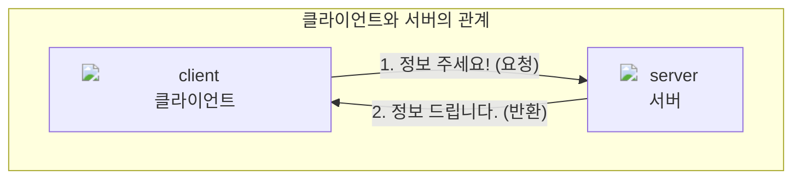
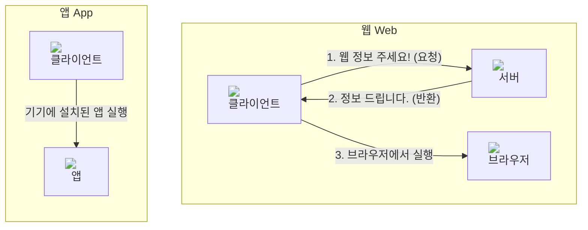
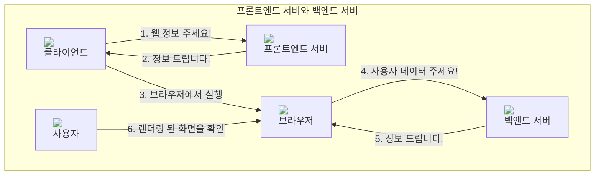
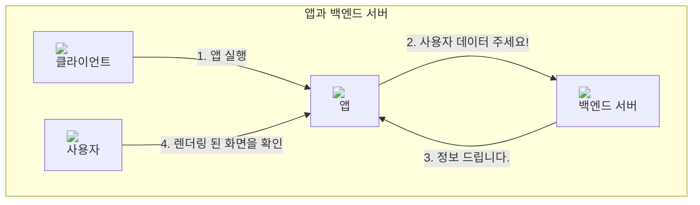

클라이언트와 서버가 무엇인지에 대한 기본적인 개념을 알아봅시다. 개발은 크게 클라이언트에서 동작하는 코드를 개발하는 것과 서버에서 동작하는 코드를 개발하는 것으로 나뉩니다.

흔히 말하는 웹, 앱, 프론트엔드, 백엔드 등의 개념도 클라이언트와 서버의 개념으로부터 설명될 수 있습니다.

### 클라이언트

클라이언트(client)는 고객, 손님이라는 단어 뜻와 비슷하게 인터넷을 통해 서비스에 필요한 것을 요청하는 사용자를 의미합니다. 웹 사이트에 접속할 때 쓰는 노트북, 컴퓨터, 스마트폰 등이 클라이언트가 될 수 있습니다.

클라이언트는 서버에 정보나 자원을 요청하고, 서버로부터 응답을 받습니다.

### 서버

티켓팅을 하거나 게임을 할때 사용자가 몰려서 "서버가 터졌다"라는 말을 한번쯤은 듣거나 겪어보셨을 겁니다. 서버(server)는 클라이언트에게 네트워크를 통해 서비스를 제공하는 컴퓨터입니다. 

서버가 클라이언트로부터 정보를 달라는 요청을 받으면 그에 대해 응답합니다. 클라이언트에서 요청받은 데이터를 전달하거나 저장하는 역할을 합니다. 일반적으로 많은 양의 데이터를 저장하거나 복잡한 연산을 수행할 수 있습니다. 

---

## 클라이언트 사이드

### 앱과 웹

위에서 노트북, 컴퓨터, 스마트폰 등이 클라이언트가 될 수 있다고 언급했습니다. 하지만 컴퓨터 기기만 있다고 해서 클라이언트의 역할을 하는 것이 아닙니다. 보통 클라이언트에선 **웹** 또는 **앱**을 통해 인터넷과 통신합니다.

웹과 앱은 클라이언트에서 사람이 보는 화면을 그리고, 사용자의 동작에 따라 서버에 요청을 보냅니다. 여기서 웹과 앱을 구성하는 코드와 프로그램을 **클라이언트 사이드**라고 부릅니다.

웹과 앱의 차이점은 크게 두가지가 있습니다.

- 코드 저장 여부: 웹은 (일반적으로) 접속시 서버로부터 코드를 새로 받아오고, 앱은 기기에 설치된 코드를 사용합니다. 웹은 코드를 인터넷에서 받아온 후 실행하기 때문에 초기 접속이 앱보다 느릴 수 있습니다.
- 코드 실행 위치: 웹은 브라우저 위에서 코드를 실행하고, 앱은 기기에서 코드를 바로 실행합니다. 그래서 웹보다 앱이 하드웨어 기기에 관련된 기능을 개발하기에 더 수월합니다. 

흔히 말하는 [프론트엔드](/dsm-freshman-guide/frontend/00-start)는 브라우저 위에서 웹을 보여주는 화면을 개발하는 것이고, [iOS](/dsm-freshman-guide/ios/00-start)와 [안드로이드](/dsm-freshman-guide/android/00-start) 개발은 각 핸드폰 운영체제에 맞는 앱을 개발하는 것입니다.

## 서버 사이드

### 프론트엔드 서버와 백엔드 서버

클라이언트 사이드가 클라이언트에서 실행되는 코드라면, **서버 사이드**는 서버에서 실행되는 코드입니다. 서버는 사용자의 응답에 따라 정보를 저장하거나 반환하는 역할을 합니다. 

웹이 발전하기 이전에는 데이터를 저장하는 역할과 클라이언트에서 실행하는 코드를 반환하는 두 역할을 한 서버에서 수행했습니다. 이 방식에선 한 서버에서 정보 저장, 클라이언트 코드 반환 등의 많은 역할을 가지고 있어 유지보수나 서버 성능 관리가 어려웠습니다. 

따라서 최근에는 클라이언트의 브라우저 위에서 실행할 코드를 반환하는 **프론트엔드 서버**와, 정보를 저장하고 로직을 수행하는 **백엔드 서버**를 분리하여 개발하는 경우가 많습니다. 예상 가능하다시피 백엔드 서버의 코드를 개발하는 것을 [백엔드 개발](/dsm-freshman-guide/backend/00-start)이라고 합니다.

프론트엔드 서버와 백엔드 서버가 분리된 상태에서는 웹사이트에 접속할 때 아래와 같은 과정을 거칩니다.

1. 클라이언트에서 실행할 코드를 프론트엔드 서버에 요청하여 가져옵니다. 
2. 백엔드 서버에서 서버가 가지고 있는 데이터를 가져옵니다. 이 데이터는 게시판 사이트에선 게시글 목록이 될 수도 있고, 채팅 사이트라면 채팅 데이터가 될 수 있습니다.
3. 브라우저에서 프론트엔드 코드와 백엔드 서버에서 가져온 데이터를 합쳐 렌더링합니다.
4. 사용자는 컴퓨터 화면에서 그 결과를 확인합니다.

> 참고: 렌더링은 브라우저에서 코드를 눈에 보이는 화면으로 만들어주는 과정입니다. 하지만 화면을 보여주는 코드 템플릿에 동적인 정보를 삽입하는 것을 렌더링이라고 하기도 하는데, 이 작업은 서버 사이드 렌더링(SSR)과 클라이언트 사이드 렌더링(CSR)으로 나뉩니다. 이 글에선 렌더링 개념에 대해 엄밀히 다루지는 않습니다.

앱에서도 마찬가지로 백엔드 서버에 요청을 보내 정보를 받아오고, 데이터를 합쳐 화면에 보여줍니다. 위 도식에서 프론트엔드 서버를 제외한 과정과 같습니다.

---

## 마무리

클라이언트와 서버의 개념을 이해하고, 클라이언트에서 실행되는 웹, 앱과 프론트엔드 서버, 백엔드 서버의 개념에 대해 알아보았습니다. 개념 자체는 크게 낯설지 않을 것이라 생각합니다. 전반적인 구조와 관계를 생각하며 학습한다면 추후에도 크게 도움될 내용이니 잘 익히고 넘어가시면 좋을 것 같습니다!

### 참고

- [위키피디아 - 클라이언트 서버 모델](https://ko.wikipedia.org/wiki/클라이언트_서버_모델)
- [cloudflare - 클라이언트 사이드 vs 서버 사이드](https://www.cloudflare.com/ko-kr/learning/serverless/glossary/client-side-vs-server-side/)
- [aws - 프론트엔드와 백엔드의 차리](hhttps://aws.amazon.com/ko/compare/the-difference-between-frontend-and-backend)
- [aws - 웹 애플리케이션](hhttps://aws.amazon.com/ko/what-is/web-application)
- [TCP School - 웹 기본](https://www.tcpschool.com/webbasic/www)